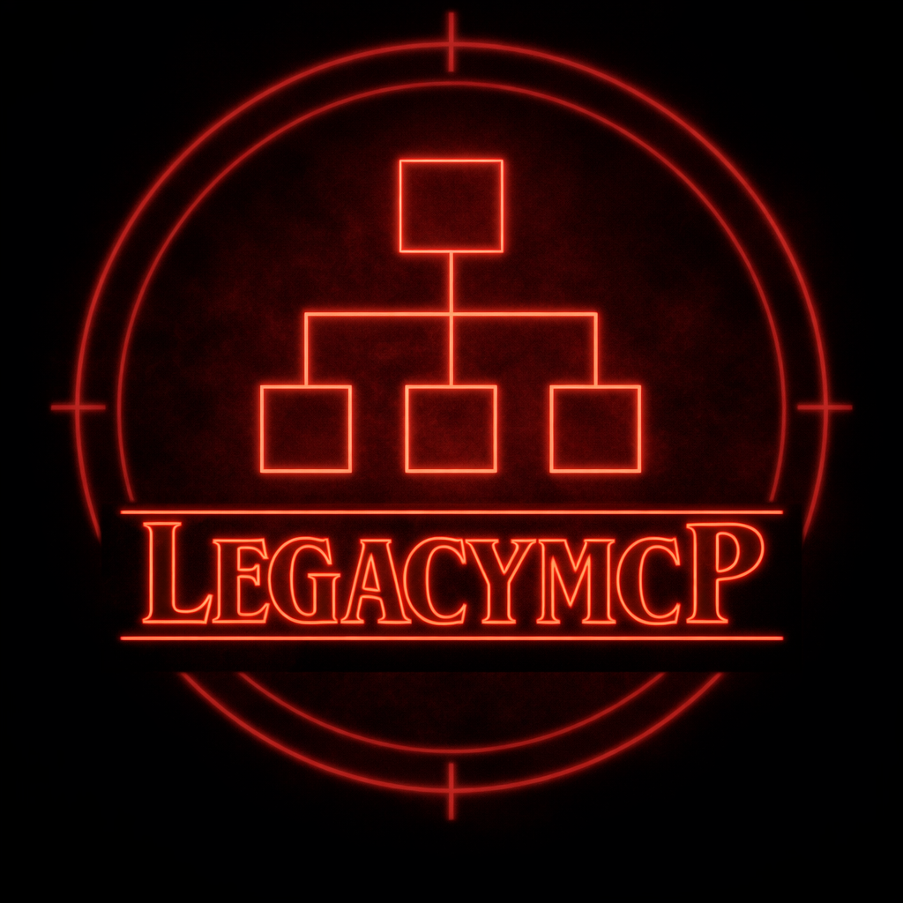
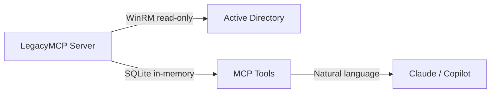
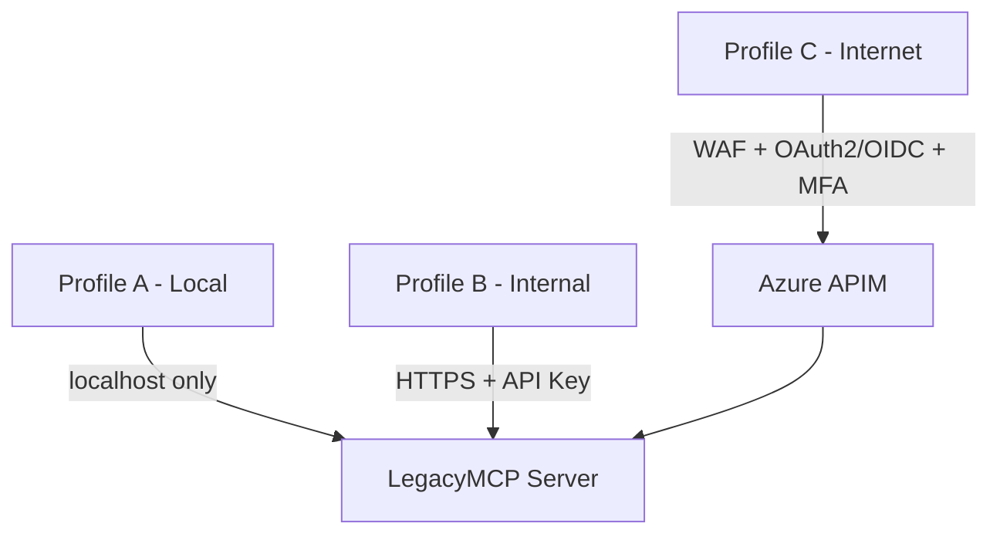

# LegacyMCP

  

> Active Directory MCP Server for AI-powered assessment

LegacyMCP brings the power of AI to Active Directory on-premises environments.
It exposes AD data as tools that Claude and other LLMs can query directly —
turning a static assessment script into an interactive, intelligent conversation
with your infrastructure.

No more 200-page Word documents that nobody reads.
Ask questions, get answers, understand your AD.

---

## Why LegacyMCP

Active Directory is still the backbone of most enterprise environments.
Despite the cloud push, AD on-prem is very much alive — and largely invisible
to modern AI tooling.

LegacyMCP fills that gap.

It was born out of a real consulting need: the Identity team at
[Impresoft 4ward](https://www.4ward.it/) runs AD assessments for
enterprise clients regularly. The goal was to make that process faster,
smarter, and more useful — and to share the result with the community.

---

## Two modes, one interface

**Live Mode**
Connects directly to Domain Controllers via WinRM and PowerShell.
Real-time data, ideal for internal admins or consultants with direct
network access.

**Offline Mode**
A PowerShell collector exports AD data to a structured JSON file.
The MCP server loads and queries that data locally — no network access
required during analysis. Perfect for remote consulting scenarios.

---

## Multi-scope Workspace

LegacyMCP understands that real-world assessments are rarely simple:

- Single domain — limited access, no Enterprise Admin required
- Full forest — global view with Enterprise Admin
- Multiple forests — separate environments, independent analysis
- Migration scenarios — source/destination mapping, SIDHistory tracking,
  naming conflict detection

---

## What it covers

LegacyMCP Core covers everything in Carl Webster's legendary
ADDS_Inventory script (https://github.com/CarlWebster/Active-Directory-V3) 
— now queryable via natural language:

- Forest and domain configuration
- Optional AD features (Recycle Bin, etc.)
- AD Schema — custom objects and attributes
- Domain Controllers, FSMO roles, local settings (NTP, registry)
- Event Log configuration per DC
- SYSVOL state and replication
- Sites, site links, replication topology
- Users — counts, states, privileged accounts
- Groups — privileged groups, nested membership
- Organizational Units — full OU tree
- GPO Inventory — list, OU links, blocked inheritance
- Trust relationships — type, direction, SIDHistory
- Fine-Grained Password Policies
- DNS configuration on Domain Controllers
- PKI / CA Discovery — Certification Authorities from AD

---

## Enterprise layer

Impresoft 4ward maintains a proprietary enterprise layer on top of LegacyMCP Core:

- **DHCP Analysis** — DHCP infrastructure assessment
- **GPO Analysis** — deep Group Policy analysis
- **AD Security Analysis** — security posture assessment
- **AD Health Check** — misconfiguration and operational health review
- **PKI Configuration Analysis** — CA infrastructure and certificate template review
- **PKI Security Analysis** — PKI security assessment
- **ESC Analysis** — certificate template vulnerability assessment
- **DOCX generation** — automated assessment documents from corporate templates

Interested? Get in touch.

---

## Security by Design

LegacyMCP is built around ten security principles that apply across every deployment scenario:

1. **Read-only by design** — LegacyMCP never creates, modifies, or deletes any AD object. This is an architectural decision, not a limitation.

2. **Least privilege** — the tool operates with the minimum rights required. In Offline Mode, no live AD credentials are needed at all.

3. **Sensitive data stays local** — in Offline Mode, AD data never leaves the client network toward the cloud. Analysis happens locally. JSON output files are classified Confidential/Restricted.

4. **Strong authentication for exposed endpoints** — three deployment profiles with increasing security requirements: local-only, internal network, and internet-facing with WAF and OAuth2/OIDC.

5. **TLS on all non-localhost endpoints** — no plaintext traffic outside localhost under any deployment profile.

6. **Credentials never in plaintext** — gMSA for service accounts, Azure Key Vault for enterprise deployments, Windows Credential Manager for explicit credentials. Never in config files, environment variables, or logs.

7. **Code integrity** — signed PowerShell collector, signed executable releases, published SHA256 hashes for all release artifacts.

8. **Full auditability** — dedicated Windows EventLog, every operation logged with who requested what, when, and on which objects. SIEM and Sentinel compatible.

9. **Unified data format** — Live Mode snapshots and Offline Mode JSON files share the same format, enabling temporal comparisons and full interoperability between modes.

10. **Safe degradation** — partial data is always explicit. Unreachable domain controllers are flagged, never silently skipped.

See [DISCLAIMER.md](DISCLAIMER.md) for terms of use.

---

## Built for enterprise environments

- **gMSA support** — no password management headaches
- **Windows Service** — install, forget, monitor
- **Dedicated EventLog** — full audit trail, SIEM-ready
- **Performance Counters** — heartbeat and DC reachability monitoring *(roadmap)*
- **Graceful degradation** — partial data is better than no data
- **Three deployment profiles** — local offline, internal network,
  internet-facing with WAF

---

## Requirements

- Windows Server 2012 R2 and later
- Python 3.10+
- PowerShell 5.1 or later — required to run the collector on the target AD environment
- Claude Desktop or any MCP-compatible client

---

## Author

**Marco Lelli**
Head of Identity — [Impresoft 4ward](https://www.4ward.it/)
Microsoft Identity specialist with 25+ years in enterprise IT infrastructure.

📖 Follow the build story on [Legacy Things](https://legacythings.it) —
a technical blog about the legacy mechanisms that still run the world.

---

## License

MIT — free to use, modify, and distribute.
See [LICENSE](LICENSE) for details.