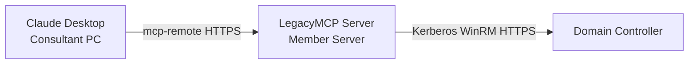

# Getting Started — Profile B-core (LAN Endpoint)

> This guide covers **Profile B-core** — a LegacyMCP server running on a
> Windows member server inside the client network, accessible over HTTPS
> from the consultant's machine via Claude Desktop.
>
> For the simpler local setup, see [getting-started-a.md](getting-started-a.md).

---

Profile B-core is for consulting scenarios where the consultant cannot or
should not run the MCP server on their own machine. It's the only profile
that can connect live to an Active Directory environment.

---

## Overview

Profile B-core is designed for consulting scenarios where:
- The MCP server must run on a dedicated machine inside the client network
- The consultant connects remotely via Claude Desktop
- The server queries Active Directory live via Kerberos over WinRM HTTPS



---

## WinRM Prerequisites

Before installing LegacyMCP, verify the following on each target Domain Controller.

**WinRM HTTPS listener (port 5986)**
```powershell
winrm enumerate winrm/config/listener
```
The output must include a listener with `Transport = HTTPS` and a valid
`CertificateThumbprint`. If missing, configure it:
```powershell
# Replace thumbprint with your DC certificate thumbprint
winrm create winrm/config/listener?Address=*+Transport=HTTPS @{Hostname="dc01.contoso.local";CertificateThumbprint="YOUR_THUMBPRINT"}
```

**Valid certificate on the DC**
The DC must have a certificate issued by an internal CA (Domain Controller
template). A self-signed certificate works for testing.
Verify:
```powershell
Get-ChildItem Cert:\LocalMachine\My | Where-Object {$_.Thumbprint -eq "YOUR_THUMBPRINT"} | Format-List Subject, NotAfter, HasPrivateKey
```

**TLS 1.2 enabled (required on Windows Server 2012 R2)**
Windows Server 2012 R2 does not enable TLS 1.2 by default. Python 3.11+
requires TLS 1.2. Enable it via registry on each affected DC and reboot:
```powershell
$base = "HKLM:\SYSTEM\CurrentControlSet\Control\SecurityProviders\SCHANNEL\Protocols\TLS 1.2"
New-Item "$base\Server" -Force | Out-Null
New-Item "$base\Client" -Force | Out-Null
Set-ItemProperty "$base\Server" -Name "Enabled"           -Value 1 -Type DWord
Set-ItemProperty "$base\Server" -Name "DisabledByDefault" -Value 0 -Type DWord
Set-ItemProperty "$base\Client" -Name "Enabled"           -Value 1 -Type DWord
Set-ItemProperty "$base\Client" -Name "DisabledByDefault" -Value 0 -Type DWord
Restart-Computer
```
Windows Server 2016 and later have TLS 1.2 enabled by default — verify
with `Get-Item "HKLM:\...\TLS 1.2\Server"` if in doubt.

**Internal CA not expired**
If the DC certificate is issued by an internal CA, verify the CA is not
expired before issuing or renewing the DC certificate.

**MCP server placement**
The LegacyMCP server runs on the **dedicated member server**, not on any
Domain Controller. The member server must have network access to the DCs
on port 5986.

**Service account**
The installer configures a gMSA (recommended) or a dedicated domain account
with Domain Admin rights and WinRM access to the target DCs. With a gMSA,
Windows manages credentials automatically — no passwords stored anywhere.

---

## Prerequisites

**Server machine (member server — never a Domain Controller):**
- Windows Server 2016 or later recommended (2012 R2 supported)
- Python 3.10+ — must be installed **for all users** (not per-user). During installation, select 'Install for all users' in the Python installer. This is required because the LegacyMCP Windows Service runs under a dedicated service account, not the installing user.
- PowerShell 5.1+
- RSAT-AD-PowerShell (`Add-WindowsFeature RSAT-AD-PowerShell`) — required for Live Mode
- RSAT-DNS-Server (`Add-WindowsFeature RSAT-DNS-Server`) — required for Live Mode

  See [Minimum Permissions](minimum-permissions.md) for the full delegation matrix and setup scripts.
- Domain-joined, with a service account (gMSA recommended)
- WinRM HTTPS enabled on target Domain Controllers (port 5986)
- NSSM (bundled in `installer/tools/`)

**Consultant machine:**
- Node.js 18+ (for mcp-remote)
- Claude Desktop with Pro plan
- Network access to the server machine on port 8000

---

## Installation — Server Side

### 1. Copy the installer source

Copy the `legacy-mcp` source folder to the server machine
(e.g. `C:\LegacyMCP-Setup\`). The server machine does not require git.

### 2. Run the installer

Open PowerShell as Administrator:

```powershell
cd C:\LegacyMCP-Setup\installer
.\Setup-LegacyMCP.ps1 -Profile B-core -Role Server -Mode Install -ServiceAccount "DOMAIN\svc_legacymcp$"
```

For a non-gMSA account:

```powershell
.\Setup-LegacyMCP.ps1 -Profile B-core -Role Server -Mode Install -ServiceAccount "DOMAIN\svc_legacymcp"
```

The installer will:
- Create the Python virtual environment in `%ProgramFiles%\LegacyMCP\.venv`
- Generate a TLS certificate (self-signed SHA-256) in `%ProgramData%\LegacyMCP\certs\`
- Generate an API key and store it encrypted (DPAPI-NG, SID-scoped)
- Write configuration paths to the Windows registry
- Register and start the Windows service via NSSM
- Register the Windows EventLog source
- Create a Windows Firewall rule to allow inbound TCP on port 8000

**Windows Firewall**
The installer automatically creates a firewall rule to allow inbound
TCP traffic on port 8000 (Domain and Private network profiles).
If you reinstall the service under a different service account,
run the installer again to ensure the rule is in place — changing
the service account does not update existing firewall rules.

To verify manually:
```powershell
Get-NetFirewallRule -DisplayName "LegacyMCP MCP Server"
```

### 3. Configure workspaces

```powershell
.\Manage-Workspaces.ps1 -Add -Name "contoso.local" -File "%ProgramData%\LegacyMCP\data\contoso.local.json"
```

For a live workspace:

```powershell
.\Manage-Workspaces.ps1 -Add -Name contoso.local -DC dc01.contoso.local
```

> **Note:** when modifying a workspace JSON, `Manage-Workspaces.ps1`
> automatically creates a `backups\` folder next to the JSON file
> containing the previous version. Backup files contain AD data
> and must be treated with the same sensitivity as the source JSON —
> store them in a secure location and do not commit them to version control.

### 4. Copy the TLS certificate to the consultant machine

The server certificate is at `%ProgramData%\LegacyMCP\certs\server.crt`.
The path is also recorded in the Windows registry under
`HKLM:\SOFTWARE\LegacyMCP\CertFile`.

Copy `server.crt` to the consultant machine via a secure channel.

---

## Installation — Client Side

Run the unified installer on the consultant machine as your **normal user account
(not Administrator)**. Copy `installer\` (including `installer\modules\` and
`installer\mcp-remote-live.ps1`) to the consultant machine if needed.

```powershell
cd C:\LegacyMCP-Setup\installer
.\Setup-LegacyMCP.ps1 -Profile B-core -Role Client -Mode Install `
  -ServerUrl "https://SERVER_IP:8000/mcp" `
  -CaCertPath "C:\path\to\server.crt"
```

The script will prompt for the API key, then:
- Copy the CA certificate to `%LOCALAPPDATA%\LegacyMCP\certs\`
- Store the API key encrypted (DPAPI user-scope) in `%LOCALAPPDATA%\LegacyMCP\.legacymcp-key`
- Generate `%LOCALAPPDATA%\LegacyMCP\mcp-remote-live.bat` (Claude Desktop entry point)
- Update `claude_desktop_config.json` automatically

Restart Claude Desktop after setup.

---

## Verification

After restarting Claude Desktop, open a new conversation and ask:

> "List all available workspaces"

Expected response: list of configured forests with their mode (live or offline).

---

## TLS Notes

For full TLS setup details, certificate export procedures, and notes on
legacy CA compatibility, see [tls-certificate-setup.md](tls-certificate-setup.md).

---

> For assessment session tips, see [Getting Started](getting-started.md#assessment-session-tips).

---

## Troubleshooting

**Claude Desktop does not connect:**
- Verify the service is running: `Get-Service LegacyMCP`
- Check the EventLog: `Get-EventLog -LogName LegacyMCP -Newest 20`
- Verify `NODE_EXTRA_CA_CERTS` is set correctly in
  `%LOCALAPPDATA%\LegacyMCP\mcp-remote-live.bat`

**Authentication errors:**
- API key mismatch — re-run `.\Setup-LegacyMCP.ps1 -Profile B-core -Role Client -Mode Install` with the correct key
- Check server config: review `%ProgramData%\LegacyMCP\config\config.yaml`

**WinRM / Kerberos errors:**
- Verify WinRM HTTPS is enabled on the DC: `Test-WSMan -ComputerName DC01 -UseSSL`
- Verify the service account has "Allow log on as a service" right
- See [architecture.md](architecture.md) for Kerberos authentication requirements
