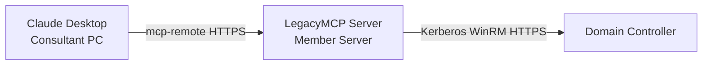

# Getting Started — Profile B-core (LAN Endpoint)

> This guide covers **Profile B-core** — a LegacyMCP server running on a
> Windows member server inside the client network, accessible over HTTPS
> from the consultant's machine via Claude Desktop.
>
> For the simpler local setup, see [getting-started-a.md](getting-started-a.md).

---

## Overview

Profile B-core is designed for consulting scenarios where:
- The MCP server must run on a dedicated machine inside the client network
- The consultant connects remotely via Claude Desktop
- The server queries Active Directory live via Kerberos over WinRM HTTPS



---

## Prerequisites

**Server machine (member server — never a Domain Controller):**
- Windows Server 2016 or later recommended (2012 R2 supported)
- Python 3.10+
- PowerShell 5.1+
- Domain-joined, with a service account (gMSA recommended)
- WinRM HTTPS enabled on target Domain Controllers (port 5986)
- NSSM (bundled in `installer/tools/`)

**Consultant machine:**
- Node.js 18+ (for mcp-remote)
- Claude Desktop with Pro plan
- Network access to the server machine on port 8000

---

## Installation — Server Side

### 1. Copy the repository

Copy the `legacy-mcp` folder to the server machine (e.g. `C:\legacy-mcp`).
The server machine does not require git.

### 2. Run the installer

Open PowerShell as Administrator:

```powershell
cd C:\legacy-mcp\installer
.\Install-LegacyMCP.ps1 -Profile B-core -ServiceAccount "DOMAIN\svc_legacymcp$"
```

For a non-gMSA account:

```powershell
.\Install-LegacyMCP.ps1 -Profile B-core -ServiceAccount "DOMAIN\svc_legacymcp"
```

The installer will:
- Create the Python virtual environment and install dependencies
- Generate a TLS certificate (self-signed SHA-256)
- Generate an API key and store it encrypted (DPAPI machine-scope)
- Register and start the Windows service via NSSM
- Register the Windows EventLog source

### 3. Configure workspaces

```powershell
.\Manage-Workspaces.ps1 -Action Add -ForestName "contoso.local" -FilePath "C:\legacy-mcp\data\contoso.local_ad-data.json"
```

For a live workspace:

```powershell
.\Config-LegacyMCP.ps1 -Action AddWorkspace -ForestName "contoso.local" -Mode live
```

### 4. Export the TLS certificate for the client

```powershell
.\Config-LegacyMCP.ps1 -Action ExportCert -OutputPath "C:\legacy-mcp\certs\server.crt"
```

Transfer `server.crt` to the consultant machine via a secure channel.

---

## Installation — Client Side

On the consultant machine, open PowerShell as Administrator:

```powershell
cd C:\GIT\legacy-mcp\installer
.\Setup-LegacyMCPClient.ps1 `
  -ServerUrl "https://SERVER_IP:8000" `
  -CaCertPath "C:\path\to\server.crt"
```

The script will prompt for the API key, then:
- Store the API key encrypted (DPAPI user-scope) in `client\.legacymcp-key`
- Generate `client\mcp-remote-live.bat` (Claude Desktop entry point)
- Update `claude_desktop_config.json` automatically

Restart Claude Desktop after setup.

---

## Verification

After restarting Claude Desktop, open a new conversation and ask:

> "List all available workspaces"

Expected response: list of configured forests with their mode (live or offline).

---

## TLS Notes

For full TLS setup details, certificate export procedures, and notes on
legacy CA compatibility, see [tls-certificate-setup.md](tls-certificate-setup.md).

---

## Troubleshooting

**Claude Desktop does not connect:**
- Verify the service is running: `Get-Service LegacyMCP`
- Check the EventLog: `Get-EventLog -LogName LegacyMCP -Newest 20`
- Verify `NODE_EXTRA_CA_CERTS` is set correctly in `mcp-remote-live.bat`

**Authentication errors:**
- API key mismatch — re-run `Setup-LegacyMCPClient.ps1` with the correct key
- Check server config: `.\Config-LegacyMCP.ps1 -Action Validate`

**WinRM / Kerberos errors:**
- Verify WinRM HTTPS is enabled on the DC: `Test-WSMan -ComputerName DC01 -UseSSL`
- Verify the service account has "Allow log on as a service" right
- See [architecture.md](architecture.md) for Kerberos authentication requirements
